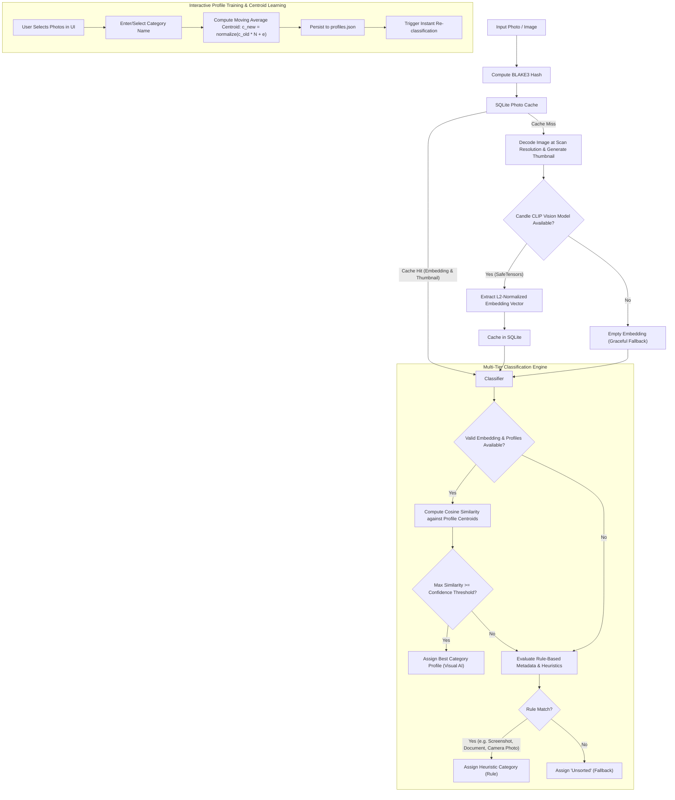

# Classification Pipeline Architecture

This document describes the multi-tiered classification pipeline implemented in `photo_organizer`.

## Managing Profiles

Trained profiles are listed in the profile modal, opened from **Manage Profiles** in
the AI & Categories panel, as a scrollable list of name and sample count. Deleting one
drops its `CategoryProfile` from `profiles.json` and re-classifies the staged photos
through the same pipeline as a threshold change, so items that were using it fall to
the next best centroid, then to the rules, then to `Unsorted`. Because a deletion is
permanent and costs the user their training for that category, the row's delete button
only arms it; the deletion happens on a second, explicit confirmation.

## Scan Decode Path

The grid wants a 200x140 thumbnail and CLIP wants a 224x224 square, so the scan
never decodes a full-resolution frame. JPEGs are decoded through
`jpeg-decoder`'s DCT scaling (1/8, 1/4 or 1/2, whichever leaves the image above
the CLIP input size), which shrinks during the inverse DCT rather than after it.
Every other format has no cheap partial decode and falls back to a full decode
followed by a rescale. The true frame dimensions are carried separately because
the rule-based heuristics in `Classifier` key off resolution.

Scans run on a dedicated rayon pool rather than the global one. The CLIP forward
pass dominates and re-reads its full weight matrix per photo, so throughput is
memory-bandwidth-bound rather than core-bound; see `scan_thread_count` for the
tuning and `PHOTO_ORGANIZER_SCAN_THREADS` to override it.

## Classification Tiers

1. **Tier 1: Visual CLIP Embedding Match**:
   - Calculates cosine similarity against all active `CategoryProfile` centroids.
   - If similarity $\ge$ the confidence threshold, category is assigned with `ClassificationSource::VisualModel`.
   - The threshold comes from `Settings::confidence_threshold` in `settings.json` (default `DEFAULT_CONFIDENCE_THRESHOLD` = 0.65), is passed into `classify`/`classify_with_heuristics` by the caller, and is adjustable on a slider in the settings modal.
2. **Tier 2: Rule-Based & Metadata Heuristics**:
   - Reached when the best centroid match falls below the threshold, or when there is no embedding or no profiles at all.
   - **Screenshots**: Detected through filename patterns (`screenshot`, `screen_shot`, `capture`, `snip`) and screen aspect ratios ($16:9, 16:10, 19.5:9$, etc.) on non-EXIF PNGs.
   - **Documents / Receipts**: Detected through filename keywords (`receipt`, `invoice`, `document`, `scan`, `bill`, `statement`).
   - **Camera Photos**: Identified when EXIF camera metadata is present.
3. **Tier 3: Fallback**:
   - Items with no visual match and no rule triggers are categorized as `"Unsorted"`.

The threshold is user-configurable on a slider in the settings modal, persisted in
`settings.json`, and clamped to `MIN_CONFIDENCE_THRESHOLD..=MAX_CONFIDENCE_THRESHOLD`
(0.30..=0.95) on both load and save. The clamp is what keeps a hand-edited file safe:
serde will happily read `99.0`, which would classify every photo as Unsorted.

It is not redundant. The threshold is the only path from Tier 1 into Tier 2, so setting
it to zero would leave screenshot, document and EXIF detection unreachable for anyone
with a trained profile. Raising it to 1.0 would do the opposite — everything routed to
the rules, Tier 1 never reachable.

Moving the slider re-runs `reclassify_all`, once the slider comes to rest at a value other
than the one the grid was last classified at (`PhotoOrganizerApp::classified_threshold`).
Neither a per-frame `changed()` test nor `Response::drag_stopped()` can stand in for that:
egui puts a slider where the pointer is on the *press* frame and on every frame the handle
travels, so the release frame carries no change at all, and the arrow keys never start a
drag. Firing on every frame the value moves would re-classify the whole grid dozens of
times a second instead.

A threshold moved while a scan is in flight does not re-classify straight away. The scan
classifies against the threshold it started with, so the photos already staged and the ones
still arriving would sit either side of the new value; the request is held in
`pending_reclassify` and spent when `ScanMessage::Complete` arrives.

`settings.json` follows the same rule — a drag in flight writes nothing, the commit frame
writes — so the file records the value the user chose rather than every value the handle
passed through on the way there.

`ProfileStore` does not own the threshold. Profiles are learned data and the threshold is
a setting, so keeping them apart is what stops a `profiles.json` written by an older
build from carrying a stale copy of a knob the UI owns.

## Category Names

Every category is also a directory name, so the pipeline never hands a raw string to
the transfer engine. `ClassificationResult.category` and `RawPhotoInput.subject` are both
`CategoryName`, which is one path component by construction, and `CategoryName` is the
single place that decides which names are allowed.

Sanitisation runs where user input enters rather than where it is used. The routes that
can reach a category are training (`ProfileStore::add_exemplar`), the per-photo custom
name input, and a trained profile's stored name — all of which go through
`from_user_input`: path separators and the characters Windows reserves become `-`,
control characters and NUL become a space, and trailing dots and spaces are trimmed
because Windows drops them when creating a file. `.` and `..` fall back to `Unsorted`,
which is what keeps a category from resolving outside the output folder.

Because sanitising happens on the way *in*, what the dropdown shows and what the folder
is called cannot drift apart — a category typed as `A/B` is stored, displayed and filed
as `A-B`. A `profiles.json` written before this type existed is the one input the app
cannot re-derive the rules for, so `ProfileStore::classify` re-sanitises the stored name
on the way out.

Raising or lowering the threshold does not change any of this: it decides *whether* a
centroid wins, never *what the name may contain*.
## Transfer Journal

Once a category has been decided, `src/transfer/` owns everything that touches the
filesystem: where a photo lands, that it gets there, that it can be recognised
afterwards, and that the whole batch can be reversed.

**One layout, one module.** `plan_batch` → `execute_batch` → `TransferJournal` →
`undo` all agree on `<output>/<Category>/<YYYY>/<MM>/<name>`, a `_1`/`_2` suffix for a
name that is taken, and `.xmp`/`.aae` beside the photo. They used to be two modules,
with the reverse direction re-deriving that layout by hand, and the two drifted in ways
that cost files: the journal recorded no `TransferMode`, so undo assumed every batch was
a move and deleting a batch of twenty *copies* deleted twenty copies; the forward
direction checked a copy's length before removing the source and the reverse direction
did not; and a sidecar's direction lived in a trailing comment next to a
`(PathBuf, PathBuf)`, so a swap compiled. `Sidecar { source, destination }` puts that
direction in the type.

**One mutation rule.** Both directions go through `place(from, to, mode)`: the forward
direction as `place(source, destination, mode)`, undo as
`place(destination, source, mode)`. It refuses to overwrite whatever is at `to` — which
is also what stops a source folder chosen as its own output folder from truncating a
photo onto itself — and it never removes `from` until the copy at `to` is verified
complete, using the byte count `fs::copy` returns. A copy that stops early is deleted
rather than left behind, which is safe in either direction precisely because `to` did
not exist when the call started.

**What undo does depends on the recorded mode.** A move is undone with another move. A
copy is undone by deleting the copies, because nothing left the source folder and
leaving them behind would make the button a lie. Either way undo checks before it
destroys anything: it will not overwrite a path that is occupied again, and it will not
move or delete a file whose `Fingerprint` — length plus modification time, the pair
git's index caches — no longer matches the journal's. A photo edited in the output
folder is left alone and reported. Emptied category folders are pruned, bounded by the
`output_dir` the journal records and by emptiness; the output folder itself never is.

**Failures are reported, not swallowed.** `execute_batch` keeps every failure in
`failed_ops` at file granularity — a sidecar that could not travel is its own entry,
because the photo beside it has already moved and must still be undoable. The app puts
the failures in the status line and keeps the failed photos in the grid. The journal
itself is written to a staging file and renamed into place, so it is either complete or
absent; if it cannot be written, the stale journal from the previous batch is removed,
because a journal Undo reads as "the last batch" while describing an older one is worse
than a visible "this batch cannot be undone".

`transfer::tests::test_undo_is_the_inverse_of_execute_for_both_modes` is the property
that ties the two directions together: for each mode, `undo(execute(inputs, mode))`
leaves the filesystem exactly as it started, sidecars included.

