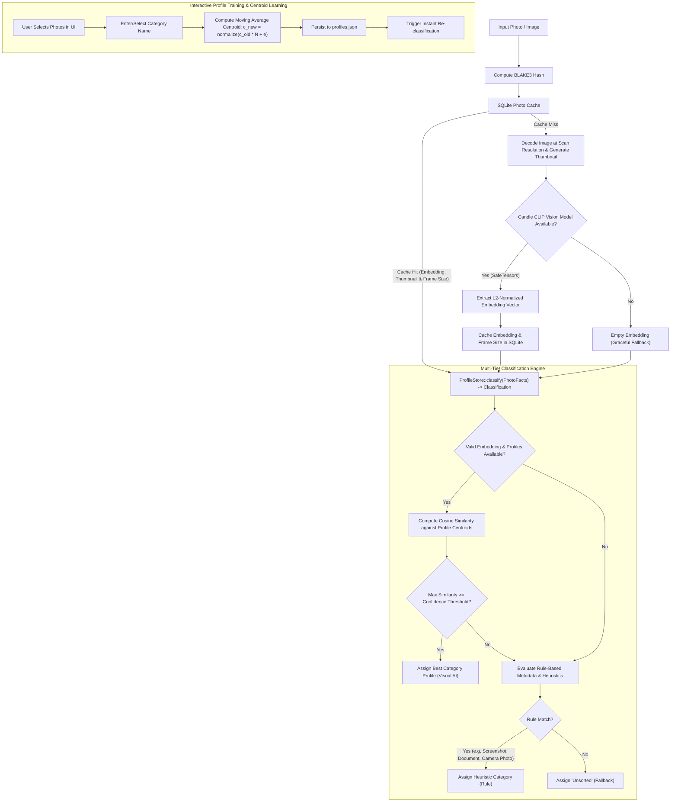

# Classification Pipeline Architecture

This document describes the multi-tiered classification pipeline implemented in `photo_organizer`.

## PhotoFacts and Classification

Classification is expressed as two records rather than a pile of fields passed
between functions, and those two records are what `ProfileStore::classify` reads
and returns:

- **`PhotoFacts`** — what a photo *is*: `path`, `date`, `frame` (its true pixel
  size), `is_exif`, `embedding`. One argument, so a caller cannot assemble a
  photo's facts out of the wrong pieces.
- **`Classification`** — what was *decided*: `Pending`, or a `Decision` carrying
  `category` (`CategoryName`), `confidence` and `source`.
  A decision carries no "is this name custom" flag. That question — does a trained
  profile own this name, and so does the free-text path apply to it — is about the
  store the caller writes against, not the one that decided, and a scan clones the
  store when it starts. So it is asked once, in `StagedItem::apply_classification`,
  against the store in hand.

### One entry point, one write path

`ProfileStore::classify(&PhotoFacts) -> Classification` is the only way a
category is decided; the visual tier, the rules and the `Unsorted` fallback all
live behind it.

`StagedItem::apply_classification` is the only way a decided category reaches a
photo on screen. A scan's `Update` and **Re-classify All** both go through it,
so they cannot disagree about what a manual pick means:

- A **pending** photo is never preserved. Its category is the
  `Classifying...` label rather than a decision, and the decision that follows
  always lands. Before this was a variant, the placeholder was stored as a real
  category, which rendered an editable text input bound to it; one keystroke
  marked the photo manual and the scan's real answer was then skipped, leaving
  the photo filed as "Classifying..." permanently.
- A **manual** photo is never re-decided: the name, confidence and source are
  the user's call. Whether the name is editable is still re-derived against the
  live profiles, because a profile can be deleted while the category stands and
  the name then has to become editable again.
- The **facts** always refresh, manual or not, so the embedding a photo was
  staged without catches up with the decision that follows.

### Pending is a state three other things have to respect

`Classification::Pending` only means anything if nothing else decides a photo
before the scan does, so the placeholder is kept off both paths that could:

- **Re-classify All** and both training routes are reachable while a scan is
  running, and all three end in `reclassify_all`. It steps over pending photos,
  because deciding one clears the `pending` flag — and that flag is the only
  thing stopping the fresh write from outranking the decision still on its way.
  Deciding a still-pending photo would replace its label with `Unsorted` *and*
  put an editable input in front of that name, one keystroke from permanently
  beating the model.
- `StagedItem::is_filable` is false for a pending photo, and
  `execute_transfer` filters on it. Move and Copy are not gated on the scan
  finishing, and the transfer seam turns whatever sits in `category` into a
  directory name, so without the guard a scan's earliest photos would land in
  `<output>/Classifying.../<YYYY>/<MM>/` and stay there through every later
  re-classification. Held photos stay in the grid, still selected, for the
  retry, and the status line says how many were held.

`ScanMessage::Update` carries `(PhotoFacts, Classification)` rather than the
eight individual values this used to declare and the app then destructured into
eight bindings to pass to an eight-argument function.

## Frame size is persisted, not reconstructed

The rule tier keys off resolution, and the grid only ever decodes a ≤200x140
thumbnail. `photo_cache` therefore stores `original_width`/`original_height`
alongside the thumbnail, and `CachedPhotoData::frame` is `Option<FrameSize>`: a
row written before those columns existed reports `None`, and the resolution rule
declines to fire rather than guessing from the thumbnail.

This is what removed a divergence. A 1920x1080 PNG was **Screenshots** on the
scan that read the file and **Unsorted** on every scan after it, with nothing
the user did to cause it: the first scan had the true frame size, and the cached
rescan substituted the thumbnail's. A scan of such a row backfills the frame
size once from the file header, so the two scans now reach the same answer.

`ScanMessage` events carry the id of the scan that produced them, and
`drain_scan_messages` drops any but the current scan's. Starting a scan clears
the staged items but cannot un-send what a superseded scan already put on the
shared channel, and a late `Update` from it was decided against the profile
store as it was at the time — it would otherwise overwrite the current scan's
photo.

## Ordering and narrowing the grid

`src/app/view.rs` is the one place that answers "is this photo in view". The grid
draws it, the footer counts it, **All**/**None** tick it, the training routes read
it, the transfer batches it and the inspection modal pages through it. Four copies
of that predicate would be four chances for the count in the footer to disagree
with the rows above it.

It runs over `Row`, a borrowing view of the five fields that decide visibility —
date, category, confidence, source — rather than over `StagedItem`. Nothing there
looks at a thumbnail or an embedding, which keeps the ordering rules assertable
without a live egui context.

The view is recomputed on demand rather than cached in a field. Items change
underneath it: a scan `Update` lands a category, a combo box renames one, the
threshold re-classifies the lot. A cache would need invalidating in each of those
places and would be stale in whichever one was missed.

### Confidence is ranked, not read

`rank_confidence` is not `item.confidence`, and the difference is the whole
point. A rule-assigned category carries a high number that measures how sure the
*rule* is, not how sure the model is — 0.85 for a screenshot caught by its
filename, 0.9 for a receipt by a keyword. Ranked as-is it files a confidently
mis-filed screenshot above a genuine match, which is backwards: the rules only ran
at all because the best centroid fell short of the user's threshold.

So a rule's number is scaled into the band *below* that threshold, which keeps
two things true at once — every rule-assigned photo sorts under every accepted
match, and two of them still order by how sure their own rule was. Pinning them
all to one value would satisfy the first and throw the second away, leaving every
screenshot tied with every receipt.

Unsorted photos keep their own number. It is a real centroid similarity, just a
low one, and a low one is what should sink them.

The confidence *filter* reads the same ranking as the confidence *sort*.
Filtering on one number and sorting on another would let the grid show a set its
own ordering does not reflect.

### `Unsorted` is not a category

`category_sort_key` files the two ways a photo can end up with no category — the
`Unsorted` fallback and a custom name cleared back to empty — under a single key
that sorts after every real name, so everything still unclassified gathers at one
end instead of filing between `Travel` and `Vacation` as though the user had
chosen it. Real keys are lower-cased, so the sentinel is too: `ZZZZ` as written
sorts *before* every one of them, since `Z` is `0x5A` and `a` is `0x61`.

The unsorted name itself is read from `CategoryName::unsorted()` rather than
copied, so the key cannot drift from the name a `Decision` actually carries.

### Ties keep their order in both directions

Descending inverts the *key* (`Reverse`), never the run. `sort_by_cached_key`
breaks ties by the position a row arrived in, so inverting the key leaves that
tie-break untouched: rows that tie — two files from one month, two at the same
confidence — stay put while the groups between them move. Reversing the slice
would shuffle them every time the user checked the other end of the order.

### A filter narrows what the actions act on

The filters scope every selection-consuming operation, not just what the grid
draws. A photo the filters exclude is not counted in the footer, not ticked by
**All**, not trained from, and not in the transfer batch.

The transfer is where this matters most, because the removal keys off what the
journal recorded as *landed*, and a photo outside the filters was never offered to
the engine — so it cannot be dropped from the grid having never been transferred.
Before this, the grid removed every ticked photo after a transfer regardless,
which under a filter silently discarded photos that had not moved anywhere.

Starting a scan clears the filters and keeps the sort. A filter was chosen
against the photos that were on screen and there are none now; carried over,
"only 2020 receipts above 80% confidence" would hide an entire new folder behind
a question the user answered about a different one.

## Managing Profiles

Trained profiles are listed in the profile modal, opened from **Manage Profiles** in
the AI & Categories panel, as a scrollable list of name and sample count. Deleting one
drops its `CategoryProfile` from `profiles.json` and re-classifies the staged photos
through the same pipeline as a threshold change, so items that were using it fall to
the next best centroid, then to the rules, then to `Unsorted`. Because a deletion is
permanent and costs the user their training for that category, the row's delete button
only arms it; the deletion happens on a second, explicit confirmation.

## Scan Decode Path

The grid wants a 200x140 thumbnail and CLIP wants a 224x224 square, so the scan
never decodes a full-resolution frame. JPEGs are decoded through
`jpeg-decoder`'s DCT scaling (1/8, 1/4 or 1/2, whichever leaves the image above
the CLIP input size), which shrinks during the inverse DCT rather than after it.
Every other format has no cheap partial decode and falls back to a full decode
followed by a rescale. The true frame dimensions are carried separately because
the rule-based heuristics in `Classifier` key off resolution.

Scans run on a dedicated rayon pool rather than the global one. The CLIP forward
pass dominates and re-reads its full weight matrix per photo, so throughput is
memory-bandwidth-bound rather than core-bound; see `scan_thread_count` for the
tuning and `PHOTO_ORGANIZER_SCAN_THREADS` to override it.

## Classification Tiers

1. **Tier 1: Visual CLIP Embedding Match**:
   - Calculates cosine similarity against all active `CategoryProfile` centroids.
   - If similarity $\ge$ the confidence threshold, category is assigned with `ClassificationSource::VisualModel`.
   - The threshold comes from `Settings::confidence_threshold` in `settings.json` (default `DEFAULT_CONFIDENCE_THRESHOLD` = 0.65), is passed into `ProfileStore::classify` by the caller — by the scanner as `ScanConfig.threshold`, and by the grid via `reclassify_all` — and is adjustable on a slider in the settings modal.
2. **Tier 2: Rule-Based & Metadata Heuristics**:
   - Reached when the best centroid match falls below the threshold, or when there is no embedding or no profiles at all.
   - **Screenshots**: Detected through filename patterns (`screenshot`, `screen_shot`, `capture`, `snip`) and screen aspect ratios ($16:9, 16:10, 19.5:9$, etc.) on non-EXIF PNGs of at least `SCREENSHOT_MIN_WIDTH` (800px).
   - **Documents / Receipts**: Detected through filename keywords (`receipt`, `invoice`, `document`, `scan`, `bill`, `statement`).
   - **Camera Photos**: Identified when EXIF camera metadata is present.
3. **Tier 3: Fallback**:
   - Items with no visual match and no rule triggers are categorized as `"Unsorted"`, still reporting how near the closest profile came.

The resolution rule is the only one that reads the frame size, so it is also the
only one that declines to fire when `PhotoFacts::frame` is `None` — a photo
cached by a version that did not record its dimensions. The filename and EXIF
rules need no frame size and keep working.

The threshold is user-configurable on a slider in the settings modal, persisted in
`settings.json`, and clamped to `MIN_CONFIDENCE_THRESHOLD..=MAX_CONFIDENCE_THRESHOLD`
(0.30..=0.95) on both load and save. The clamp is what keeps a hand-edited file safe:
serde will happily read `99.0`, which would classify every photo as Unsorted.

It is not redundant. The threshold is the only path from Tier 1 into Tier 2, so setting
it to zero would leave screenshot, document and EXIF detection unreachable for anyone
with a trained profile. Raising it to 1.0 would do the opposite — everything routed to
the rules, Tier 1 never reachable.

Moving the slider re-runs `reclassify_all`, once the slider comes to rest at a value other
than the one the grid was last classified at (`PhotoOrganizerApp::classified_threshold`).
Neither a per-frame `changed()` test nor `Response::drag_stopped()` can stand in for that:
egui puts a slider where the pointer is on the *press* frame and on every frame the handle
travels, so the release frame carries no change at all, and the arrow keys never start a
drag. Firing on every frame the value moves would re-classify the whole grid dozens of
times a second instead.

A threshold moved while a scan is in flight does not re-classify straight away. The scan
classifies against the threshold it started with, so the photos already staged and the ones
still arriving would sit either side of the new value; the request is held in
`pending_reclassify` and spent when `ScanMessage::Complete` arrives.

`settings.json` follows the same rule — a drag in flight writes nothing, the commit frame
writes — so the file records the value the user chose rather than every value the handle
passed through on the way there.

`ProfileStore` does not own the threshold. Profiles are learned data and the threshold is
a setting, so keeping them apart is what stops a `profiles.json` written by an older
build from carrying a stale copy of a knob the UI owns.

## Category Names

Every category is also a directory name, so the pipeline never hands a raw string to
the transfer engine. `Decision.category` and `RawPhotoInput.subject` are both
`CategoryName`, which is one path component by construction, and `CategoryName` is the
single place that decides which names are allowed.

Sanitisation runs where user input enters rather than where it is used. The routes that
can reach a category are training (`ProfileStore::add_exemplar`), the per-photo custom
name input, and a trained profile's stored name — all of which go through
`from_user_input`: path separators and the characters Windows reserves become `-`,
control characters and NUL become a space, and trailing dots and spaces are trimmed
because Windows drops them when creating a file. `.` and `..` fall back to `Unsorted`,
which is what keeps a category from resolving outside the output folder, as do the device
names Windows reserves as a whole component (`NUL`, `COM1`, `LPT1`, and the
ISO-8859-1 superscript spellings) because `create_dir_all` on one fails rather than
creating a directory.

Because sanitising happens on the way *in*, what the dropdown shows and what the folder
is called cannot drift apart — a category typed as `A/B` is stored, displayed and filed
as `A-B`.

A `profiles.json` written before this type existed is the one input the app cannot
re-derive the rules for, so both `CategoryProfile::new` and
`ProfileStore::load_from_file` canonicalise the name. Load-time canonicalisation is what
matters: profiles are looked up *by name*, so sanitising only the name `classify` returns
would leave `is_custom_category` comparing `A-B` against a stored `A/B`, report a trained
category as custom, and fork a duplicate profile the next time the user retrained it. The
rewrite is persisted on the next save, the way a retired `confidence_threshold` field is
dropped. `ProfileStore::classify` still runs `from_user_input` over the stored name, but
only as a backstop for a `CategoryProfile` built by struct literal.

Raising or lowering the threshold does not change any of this: it decides *whether* a
centroid wins, never *what the name may contain*.

## Transfer Journal

Once a category has been decided, `src/transfer/` owns everything that touches the
filesystem: where a photo lands, that it gets there, that it can be recognised
afterwards, and that the whole batch can be reversed.

**One layout, one module.** `plan_batch` → `execute_batch` → `TransferJournal` →
`undo` all agree on `<output>/<Category>/<YYYY>/<MM>/<name>`, a `_1`/`_2` suffix for a
name that is taken, and `.xmp`/`.aae` beside the photo. They used to be two modules,
with the reverse direction re-deriving that layout by hand, and the two drifted in ways
that cost files: the journal recorded no `TransferMode`, so undo assumed every batch was
a move and deleting a batch of twenty *copies* deleted twenty copies; the forward
direction checked a copy's length before removing the source and the reverse direction
did not; and a sidecar's direction lived in a trailing comment next to a
`(PathBuf, PathBuf)`, so a swap compiled. `Sidecar { source, destination }` puts that
direction in the type.

**One mutation rule.** Both directions go through `place(from, to, mode)`: the forward
direction as `place(source, destination, mode)`, undo as
`place(destination, source, mode)`. It refuses to overwrite whatever is at `to` — which
is also what stops a source folder chosen as its own output folder from truncating a
photo onto itself — and it never removes `from` until the copy at `to` is verified
complete, using the byte count `fs::copy` returns. A copy that stops early is deleted
rather than left behind, which is safe in either direction precisely because `to` did
not exist when the call started.

**A sidecar travels with one photo.** `discover_sidecars` claims each sidecar file
against the whole batch, not one photo. `photo.jpg` and `photo.jpeg` beside each other
both resolve to `photo.xmp` and both want it at the same destination, since the `_1`
suffix only ever lands on the photo itself; without the batch-wide claim the second
attempt failed with "does not exist" for a Move or "refusing to overwrite" for a Copy,
and the status line named a sidecar as broken when it had in fact travelled with the
first photo.

**What undo does depends on the recorded mode.** A move is undone with another move. A
copy is undone by deleting the copies, because nothing left the source folder and
leaving them behind would make the button a lie. Either way undo checks before it
destroys anything: it will not overwrite a path that is occupied again, and it will not
move or delete a file whose `Fingerprint` — length plus modification time, the pair
git's index caches — no longer matches the journal's. A photo edited in the output
folder is left alone and reported. Emptied category folders are pruned, bounded by the
`output_dir` the journal records and by emptiness; the output folder itself never is.
That bound needs the guard it has: every path starts with an empty one, so an
`output_dir` of `""` — which only something other than this app can write — would
otherwise leave `prune_empty_dirs` climbing until a folder was not empty.

**Failures are reported, not swallowed.** `execute_batch` keeps every failure in
`failed_ops` at file granularity — a sidecar that could not travel is its own entry,
because the photo beside it has already moved and must still be undoable. The app puts
the failures in the status line and keeps the failed photos in the grid.

The journal records what the transfer did, not just what it attempted, which is what
distinguishes a failed file from a landed one that is not in the state the user asked
for. A cross-device Move whose original could not be unlinked — a read-only source
folder, or a read-only file on Windows — leaves the file in both places: `place`
returns that as a `Placed.warning` rather than an `Err`, because the copy is there,
fingerprinted and reversible, and reporting it as a failure would put a file in the
output folder that no journal mentioned and no Undo could reach. It becomes its own
`failed_ops` entry, so the status line still turns amber and still says why, while the
operation itself stays in `completed_ops`. Undo surfaces the same condition as
`UndoStatus::Failed` for the same reason: it has put the photo back, but there is a
leftover to find.

A batch that lands nothing is not journalled at all. There is no new batch to record,
and overwriting the single slot would throw away the only record of the last one that
did move anything — so the previous journal stays and the status line says so. The
journal itself is written to a staging file and renamed into place, so it is either
complete or absent; if it cannot be written, the stale journal from the previous batch
is removed, because a journal Undo reads as "the last batch" while describing an older
one is worse than a visible "this batch cannot be undone".

`transfer::tests::test_undo_is_the_inverse_of_execute_for_both_modes` is the property
that ties the two directions together: for each mode, `undo(execute(inputs, mode))`
leaves the filesystem exactly as it started, sidecars included.

A staged photo's `category` is a plain `String` rather than a `CategoryName`, and is
sanitised again at the transfer seam (`CategoryName::from_user_input`). That is
deliberate: the field is bound to the grid's and the modal's free-text inputs, which
have to be able to hold a half-typed name and whatever the user is about to change it
to. Nothing is filed from it unsanitised.
