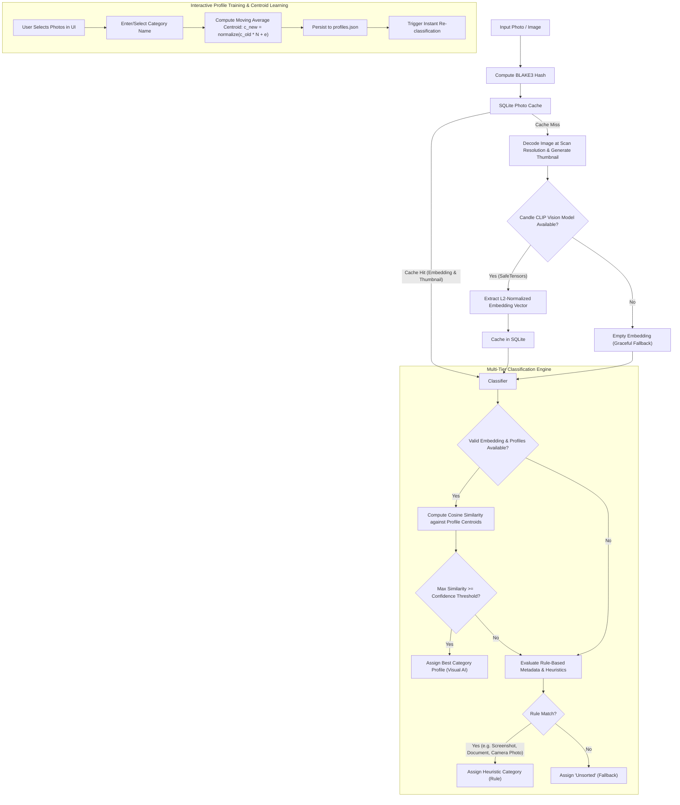

# Classification Pipeline Architecture

This document describes the multi-tiered classification pipeline implemented in `photo_organizer`.

## Managing Profiles

Trained profiles are listed in the profile modal, opened from **Manage Profiles** in
the AI & Categories panel, as a scrollable list of name and sample count. Deleting one
drops its `CategoryProfile` from `profiles.json` and re-classifies the staged photos
through the same pipeline as a threshold change, so items that were using it fall to
the next best centroid, then to the rules, then to `Unsorted`. Because a deletion is
permanent and costs the user their training for that category, the row's delete button
only arms it; the deletion happens on a second, explicit confirmation.

## Scan Decode Path

The grid wants a 200x140 thumbnail and CLIP wants a 224x224 square, so the scan
never decodes a full-resolution frame. JPEGs are decoded through
`jpeg-decoder`'s DCT scaling (1/8, 1/4 or 1/2, whichever leaves the image above
the CLIP input size), which shrinks during the inverse DCT rather than after it.
Every other format has no cheap partial decode and falls back to a full decode
followed by a rescale. The true frame dimensions are carried separately because
the rule-based heuristics in `Classifier` key off resolution.

Scans run on a dedicated rayon pool rather than the global one. The CLIP forward
pass dominates and re-reads its full weight matrix per photo, so throughput is
memory-bandwidth-bound rather than core-bound; see `scan_thread_count` for the
tuning and `PHOTO_ORGANIZER_SCAN_THREADS` to override it.

## Classification Tiers

1. **Tier 1: Visual CLIP Embedding Match**:
   - Calculates cosine similarity against all active `CategoryProfile` centroids.
   - If similarity $\ge$ the confidence threshold, category is assigned with `ClassificationSource::VisualModel`.
   - The threshold comes from `Settings::confidence_threshold` in `settings.json` (default `DEFAULT_CONFIDENCE_THRESHOLD` = 0.65), is passed into `classify`/`classify_with_heuristics` by the caller, and is adjustable on a slider in the settings modal.
2. **Tier 2: Rule-Based & Metadata Heuristics**:
   - Reached when the best centroid match falls below the threshold, or when there is no embedding or no profiles at all.
   - **Screenshots**: Detected through filename patterns (`screenshot`, `screen_shot`, `capture`, `snip`) and screen aspect ratios ($16:9, 16:10, 19.5:9$, etc.) on non-EXIF PNGs.
   - **Documents / Receipts**: Detected through filename keywords (`receipt`, `invoice`, `document`, `scan`, `bill`, `statement`).
   - **Camera Photos**: Identified when EXIF camera metadata is present.
3. **Tier 3: Fallback**:
   - Items with no visual match and no rule triggers are categorized as `"Unsorted"`.

The threshold is user-configurable on a slider in the settings modal, persisted in
`settings.json`, and clamped to `MIN_CONFIDENCE_THRESHOLD..=MAX_CONFIDENCE_THRESHOLD`
(0.30..=0.95) on both load and save. The clamp is what keeps a hand-edited file safe:
serde will happily read `99.0`, which would classify every photo as Unsorted.

It is not redundant. The threshold is the only path from Tier 1 into Tier 2, so setting
it to zero would leave screenshot, document and EXIF detection unreachable for anyone
with a trained profile. Raising it to 1.0 would do the opposite — everything routed to
the rules, Tier 1 never reachable.

Moving the slider re-runs `reclassify_all`. That fires on slider *release* rather than
on every frame the value changes: dragging across the range would otherwise re-classify
the whole grid dozens of times a second.

`ProfileStore` does not own the threshold. Profiles are learned data and the threshold is
a setting, so keeping them apart is what stops a `profiles.json` written by an older
build from carrying a stale copy of a knob the UI owns.
